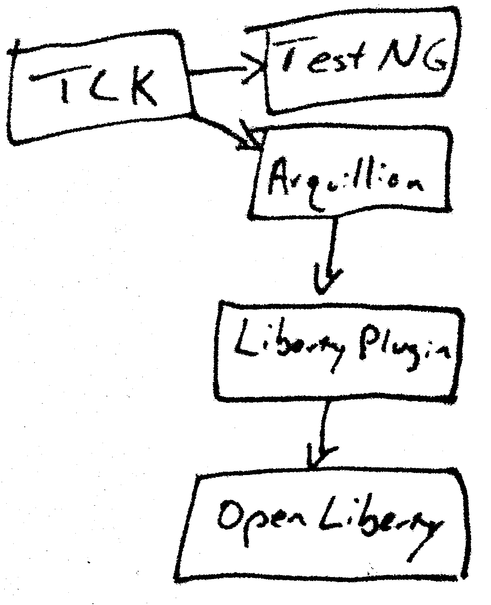

# Jakarta REST 3.1 TCK Example

This project describes how a vendor application server might run the Jakarta REST 3.1 TCK to verify compliance.

The TCK uses Arquillian as a deployment tool. This allows vendors to build their own plugin that will allow Arquillian
to start and stop the server, deploy test applications, etc. The TCK uses TestNG as the testing framework which also
plugs into Arquillian. This project really just puts the pieces together, like so:

The real magic is in the [pom.xml file](pom.xml) - that pulls in the required dependencies (the TCK, TestNG, Arquillian,
the app server - in this case, Open Liberty, the liberty-arquillian plugin, etc.). Then it sets up the
`integration-test` target to run the tests in the TCK.

You can see it run with the command:
`mvn clean integration-test`

This project also includes some Open Liberty configuration files. To add other app servers, you would need to create
new profiles in the pom.xml file and possibly add server configuration files necessary for app deployment in the server.
Likewise, you would need to add the Arquillian plugin for that server.